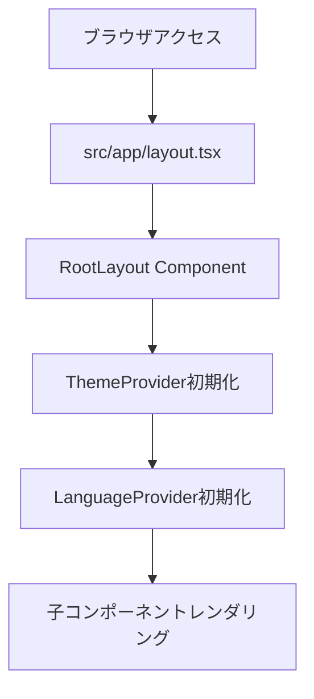
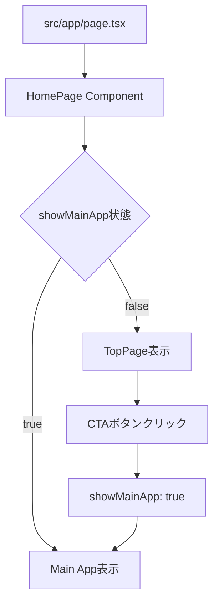
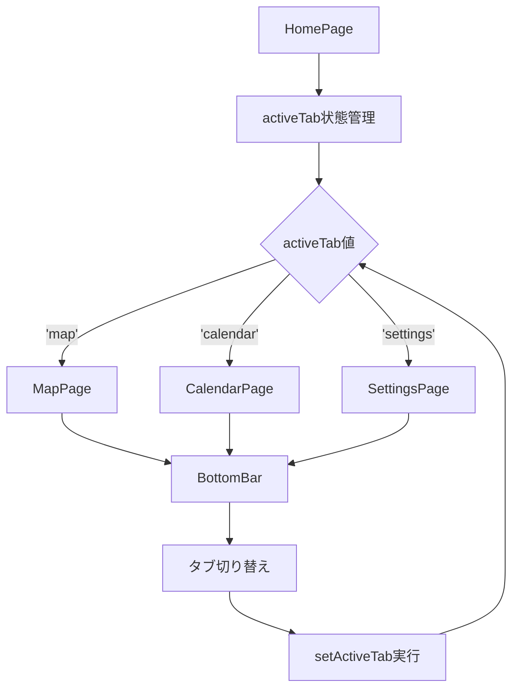
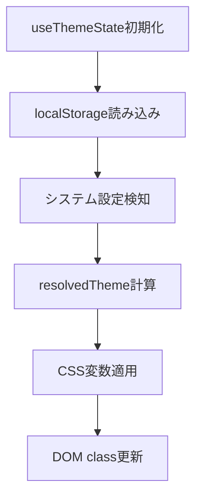
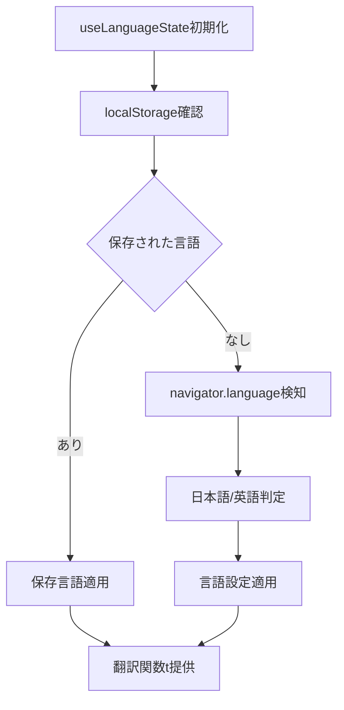
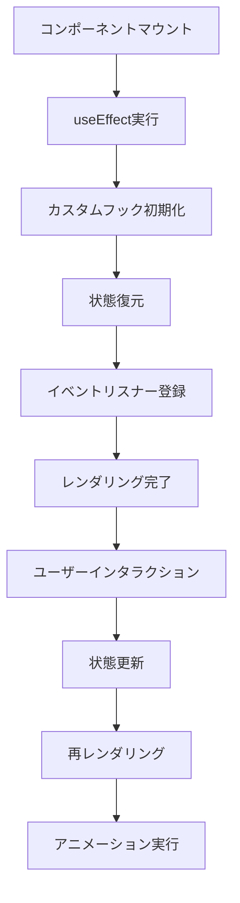

# TUSフェス アプリケーション

TUSフェス（東京理科大学学園祭）のための公式Webアプリケーションです。フェス会場のマップ、イベントスケジュール、設定画面などを提供し、来場者の体験を向上させることを目的としています。

## 📱 プロジェクト概要

このアプリケーションは、学園祭来場者がスムーズに会場内を移動し、イベント情報にアクセスできるように設計されたSPA（Single Page Application）です。

### 主な機能

- **マップ機能**: 会場内の施設や出店の位置を確認
- **カレンダー機能**: イベントスケジュールの閲覧
- **設定画面**: ダークモード、言語設定（日本語/英語）
- **レスポンシブデザイン**: モバイルファーストで設計

## 🛠️ 技術スタック

### フロントエンドフレームワーク
- **Next.js 15.5.3** - Reactベースのフルスタックフレームワーク
  - App Router使用（最新のNext.js推奨パターン）
  - 静的エクスポート対応（`output: 'export'`設定）
  - TypeScript完全対応

### UI・スタイリング
- **React 18.2.0** - コンポーネントベースのライブラリ
- **TypeScript 5.2.2** - 型安全な開発のための言語
- **Tailwind CSS 3.3.3** - ユーティリティファーストのCSSフレームワーク
  - `tailwindcss-animate` - アニメーション拡張
  - `tailwind-merge` - クラス名の競合解決
- **CSS Modules** - コンポーネント固有のスタイリング

### UIコンポーネント・アニメーション
- **Material-UI (MUI) 7.3.2** - マテリアルデザインコンポーネント
  - `@mui/material` - コアコンポーネント
  - `@mui/icons-material` - アイコンライブラリ
  - `@emotion/react`, `@emotion/styled` - CSS-in-JS
- **Radix UI** - アクセシブルなプリミティブコンポーネント
  - `@radix-ui/react-dialog` - モーダル・ダイアログ
  - `@radix-ui/react-tabs` - タブコンポーネント
  - `@radix-ui/react-slot` - 合成コンポーネント
- **Framer Motion 12.23.16** - 高性能アニメーションライブラリ
- **Lucide React 0.446.0** - 美しいアイコンセット

### ユーティリティ・開発ツール
- **class-variance-authority** - バリアント管理
- **clsx** - 条件付きクラス名の組み立て
- **ESLint** - コード品質管理
- **next-env.d.ts** - Next.js型定義

## 🏗️ アーキテクチャ

### ディレクトリ構造

```
tusfes/
├── src/
│   ├── app/                    # Next.js App Router
│   │   ├── layout.tsx         # ルートレイアウト
│   │   ├── page.tsx           # ホームページ
│   │   └── globals.css        # グローバルスタイル
│   └── components/            # コンポーネント群
│       ├── pages/             # ページ固有コンポーネント
│       │   ├── calendar/      # カレンダーページ
│       │   ├── map/           # マップページ
│       │   └── setting/       # 設定ページ
│       └── shared/            # 共通コンポーネント
│           ├── common/        # 汎用コンポーネント
│           ├── home/          # ホーム関連
│           ├── layout/        # レイアウト要素
│           ├── providers/     # Context Providers
│           └── ui/            # UIプリミティブ
├── hooks/                     # カスタムフック
│   ├── use-theme.ts          # テーマ管理
│   ├── use-language.ts       # 言語切り替え
│   └── use-user-data.ts      # ユーザーデータ
├── lib/                      # ユーティリティ
├── styles/                   # スタイル定義
├── types/                    # TypeScript型定義
└── public/                   # 静的ファイル
```

### アーキテクチャの特徴

#### 1. **コンポーネント設計パターン**
- **Atomic Design思想**: `pages` → `shared` → `ui` の階層構造
- **関心の分離**: 各コンポーネントは単一責任を持つ
- **コンポーネントコロケーション**: `.tsx`と`.module.css`のペアで管理

#### 2. **状態管理アーキテクチャ**
- **Context API + カスタムフック**: グローバル状態管理
- **Local State**: コンポーネント内の状態はuseStateで管理
- **Provider Pattern**: テーマとユーザー設定を全体で共有

#### 3. **型安全設計**
- **TypeScript First**: 全コンポーネントで型定義
- **Props Interface**: 各コンポーネントの入力を厳密に定義
- **Path Mapping**: `@/`エイリアスで相対パス解決

#### 4. **レスポンシブアーキテクチャ**
- **Mobile First**: 小画面から大画面への段階的拡張
- **CSS Grid & Flexbox**: モダンなレイアウト手法
- **Tailwind Breakpoints**: 一貫したレスポンシブ設計

## 🔄 レンダリングフロー

### 1. **アプリケーション初期化**



**詳細解説:**
1. **`layout.tsx`**: Next.js App Routerのルートレイアウト
   - `Inter`フォントの読み込み
   - HTML構造の基盤を提供
   - メタデータ設定（title, description）

2. **Provider初期化**:
   - `ThemeProvider`: ダークモード・ライトモードの状態管理
   - `LanguageProvider`: 日本語・英語切り替えの状態管理

### 2. **ページルーティング**



**詳細解説:**
1. **ルートページ** (`src/app/page.tsx`):
   - `'use client'`ディレクティブでクライアントサイド実行
   - `HomePage`コンポーネントを呼び出し

2. **状態遷移**:
   - 初期状態: `showMainApp = false` → `TopPage`表示
   - CTA押下後: `showMainApp = true` → メインアプリ表示

### 3. **メインアプリケーションフロー**



**詳細解説:**
1. **タブベースナビゲーション**:
   - `activeTab`状態でページ切り替え
   - Switch文によるコンポーネント条件レンダリング

2. **BottomBar連携**:
   - Material-UIアイコンとFramer Motionアニメーション
   - `onTabChange`コールバックで状態更新

### 4. **状態管理フロー**

#### テーマ管理（`use-theme.ts`）


#### 言語管理（`use-language.ts`）


### 5. **コンポーネントライフサイクル**



## 🚀 セットアップ・開発手順

### 前提条件
- **Node.js**: 18.0.0以上
- **npm**: 9.0.0以上（またはyarn/pnpm）
- **Git**: バージョン管理用

### 1. リポジトリクローンと依存関係インストール

```bash
# リポジトリをクローン
git clone <repository-url>
cd tusfes

# 依存関係インストール
npm install
```

### 2. 開発サーバー起動

```bash
# 開発サーバー起動（ポート3000）
npm run dev
```

ブラウザで `http://localhost:3000` にアクセスして動作確認

### 3. ビルドとデプロイ

```bash
# 本番ビルド
npm run build

# 本番サーバー起動
npm run start

# 静的ファイル出力（デプロイ用）
# next.config.jsのoutput: 'export'により自動で静的ファイル生成
```

### 4. 開発時のワークフロー

1. **ブランチ作成**: `git checkout -b feature/new-feature`
2. **コード変更**: TypeScriptで型安全な開発
3. **Lint実行**: `npm run lint`
4. **ビルド確認**: `npm run build`
5. **コミット**: `git commit -m "feat: add new feature"`

## 📋 追加情報

### 設定ファイル詳細

- **next.config.js**: 静的エクスポート設定、ESLint無効化
- **tailwind.config.ts**: Tailwind設定、カスタムアニメーション
- **tsconfig.json**: TypeScript設定、パスマッピング

### パフォーマンス最適化

- **静的エクスポート**: CDNでの高速配信対応
- **Image最適化無効**: 静的サイト向け設定
- **Tree Shaking**: 未使用コードの自動削除
- **コンポーネント分割**: 必要な分だけ読み込み

### アクセシビリティ

- **Radix UI**: ARIA属性とキーボードナビゲーション対応
- **Material-UI**: アクセシブルなコンポーネント設計
- **Semantic HTML**: 意味のあるマークアップ構造

このREADMEは、初心者から上級者まで、プロジェクトへの参加を容易にすることを目的としています。ご質問や改善提案がありましたら、お気軽にIssueやPull Requestを作成してください。